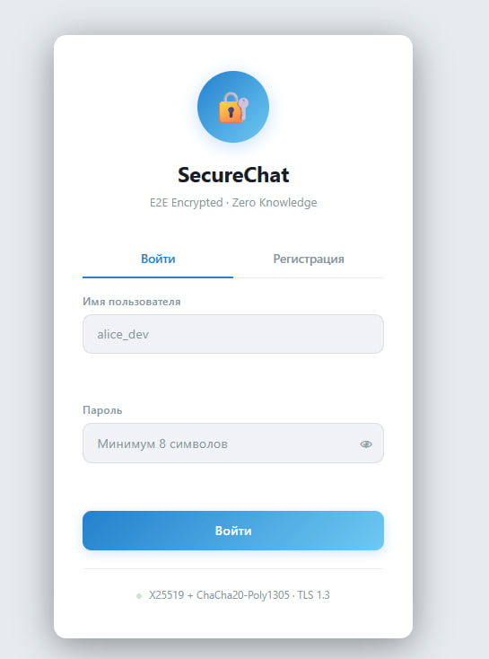
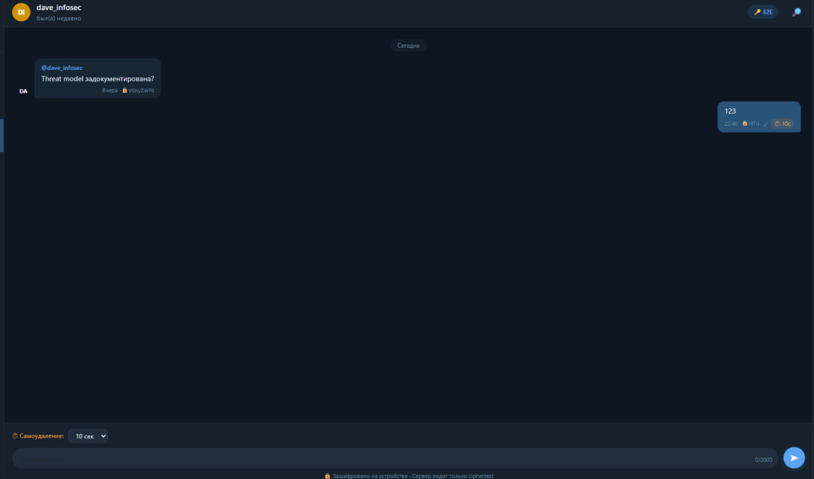
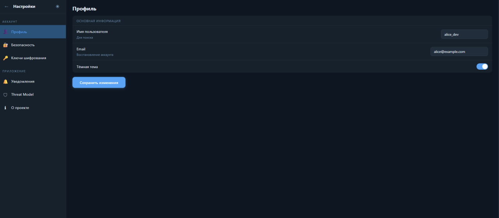

# 🔐 SecureChat — E2E Encrypted Messenger

> Дипломный проект · Защищённый мессенджер с End-to-End шифрованием

[](https://developer.mozilla.org/en-US/docs/Web/HTML)
[](https://developer.mozilla.org/en-US/docs/Web/CSS)
[](https://developer.mozilla.org/en-US/docs/Web/JavaScript)
[](https://getbootstrap.com/)
[](https://www.postgresql.org/)


---

## 📌 О проекте

**SecureChat** — это защищённый веб-мессенджер с E2E-шифрованием, разработанный в рамках дипломного проекта. Приложение демонстрирует современные подходы к безопасной передаче данных: ключи шифрования генерируются на стороне клиента и никогда не покидают устройство. Сервер оперирует только зашифрованными данными.

### Ключевые особенности

- 🔒 **E2E-шифрование** — X25519 + ChaCha20-Poly1305
- ⏱ **Самоудаляющиеся сообщения** — TTL от 10 секунд до 1 дня
- 🔑 **Zero-Knowledge сервер** — ciphertext хранится только в зашифрованном виде
- 🌙 **Тёмная/светлая тема** — с сохранением в localStorage
- 📱 **Адаптивный интерфейс** — Telegram-подобный UI
- 🛡 **Документированная Threat Model** — с анализом векторов атак

---

## 🖼 Скриншоты

| Авторизация | Чат | Настройки |
|:-----------:|:---:|:---------:|
|  |  |  |

---

## 🚀 Быстрый старт

### Требования

- Браузер с поддержкой ES6+ (Chrome 90+, Firefox 88+, Edge 90+)
- Опционально: [Live Server](https://marketplace.visualstudio.com/items?itemName=ritwickdey.LiveServer) для VS Code

### Запуск

```bash
# 1. Клонировать репозиторий
git clone https://github.com/qAkashi/securechat.git
cd securechat

# 2. Открыть в браузере
# Вариант A — просто открыть файл:
open index.html

# Вариант B — через Live Server (VS Code):
# Правой кнопкой на index.html → "Open with Live Server"
```

> **Примечание:** Проект является фронтенд-демо. Все данные хранятся в `localStorage` браузера. Реальный бэкенд не требуется для демонстрации UI.

---

## 🔑 Тестовые аккаунты

Для входа в приложение используйте любой из тестовых аккаунтов:

| 👤 Логин | 🔐 Пароль | 🎨 Роль |
|:---------|:----------|:--------|
| `alice_dev` | `password123` | Основной пользователь (запустит чат с контактами) |
| `bob_sec` | `securepass1` | Специалист по безопасности |
| `carol_ngo` | `carolpass2` | Пользователь НКО |
| `dave_infosec` | `davepass33` | Infosec инженер |
| `eve_pentest` | `evepassword` | Пентестер |

> ⚠️ Это демо-аккаунты для проверки UI. Валидация на фронтенде принимает **любой логин ≥ 3 символов** и **пароль ≥ 8 символов** — достаточно ввести любые данные для входа.

### Как войти:
1. Откройте `index.html`
2. Введите логин `alice_dev` и пароль `password123`
3. Нажмите **Войти** — откроется чат с 4 контактами
4. Попробуйте отправить сообщение с TTL 10 секунд — оно самоудалится

---

## 📁 Структура проекта

```
securechat/
├── index.html          # Страница авторизации (вход / регистрация)
├── chat.html           # Основной интерфейс чата
├── settings.html       # Настройки: профиль, ключи, безопасность
├── css/
│   └── style.css       # Все стили (CSS переменные, тёмная тема)
├── js/
│   ├── auth.js         # Логика авторизации, валидация форм
│   ├── chat.js         # Логика чата, TTL-таймеры, псевдо-E2E
│   └── settings.js     # Настройки, генерация ключей, toast-уведомления
├── database/
│   └── securechat.sql  # SQL-скрипт создания БД (PostgreSQL)
└── README.md
```

---

## 🗄 База данных

Схема базы данных реализована в PostgreSQL. SQL-скрипт находится в `database/securechat.sql`.

### Таблицы

| Таблица | Назначение |
|:--------|:-----------|
| `users` | Пользователи (Argon2id хэши паролей) |
| `user_keys` | X25519 публичные ключи шифрования |
| `sessions` | JWT-сессии с привязкой к IP |
| `conversations` | Диалоги и групповые чаты |
| `conversation_members` | M:N связь пользователей и чатов |
| `messages` | Зашифрованные сообщения + TTL |
| `message_reads` | Статус прочтения по участникам |

### Запуск БД

```bash
# Создать базу данных
createdb securechat

# Применить скрипт
psql -d securechat -f database/securechat.sql

# Подключиться и проверить
psql -d securechat -c "SELECT username, is_online FROM users;"
```

---

## 🔐 Архитектура безопасности

```
Клиент A                    Сервер                    Клиент B
──────────────────────────────────────────────────────────────
Открытый текст
    │
    ▼
ChaCha20-Poly1305 ──── ciphertext ────► БД ────► ciphertext ──── ChaCha20-Poly1305
encrypt(msg, key)    (сервер не знает    │      decrypt(msg, key)
                      содержимого)       │
                                         └─ TTL: auto-delete
```

### Threat Model

| Угроза | Статус | Защита |
|:-------|:------:|:-------|
| Компрометация сервера | ✅ Защита | E2E: сервер видит только ciphertext |
| MITM / перехват | ✅ Защита | TLS 1.3 + верификация отпечатка ключа |
| XSS / CSRF | ✅ Защита | CSP + HttpOnly + SameSite=Strict |
| Brute-force | ✅ Защита | Argon2id + Rate Limiting + блокировка |
| Утечка истории | ✅ Защита | TTL-механизм (авто-удаление из БД) |
| Физический доступ | ⚠️ Частично | IndexedDB уязвим, нужно шифрование диска |

---

## 🛠 Технологии

### Frontend
- **HTML5 / CSS3 / Vanilla JS** — без фреймворков
- **Bootstrap 5.3** — адаптивная сетка и компоненты
- **CSS Custom Properties** — переключение тёмной темы

### Криптография 
- **X25519** — обмен ключами 
- **ChaCha20-Poly1305** — симметричное шифрование сообщений
- **Argon2id** — хэширование паролей
- **SHA-256** — отпечатки ключей

### Backend 
- **Node.js + Fastify + TypeScript**
- **PostgreSQL + Prisma ORM**
- **Socket.IO** — real-time обмен сообщениями
- **Docker Compose + Caddy** — деплой

---

## 📋 Функциональность

- [x] Авторизация / Регистрация с валидацией
- [x] Список контактов с онлайн-статусами
- [x] Отправка и получение сообщений
- [x] TTL-таймеры (самоудаляющиеся сообщения)
- [x] Авто-ответы от собеседников
- [x] Статусы прочтения (✓ / ✓✓)
- [x] Поиск по контактам
- [x] Тёмная / светлая тема
- [x] Настройки безопасности
- [x] Просмотр / копирование / экспорт ключей
- [x] Перегенерация ключевой пары
- [x] Threat Model страница
- [ ] Реальный бэкенд (в разработке)
- [ ] WebCrypto API интеграция (в разработке)

---

